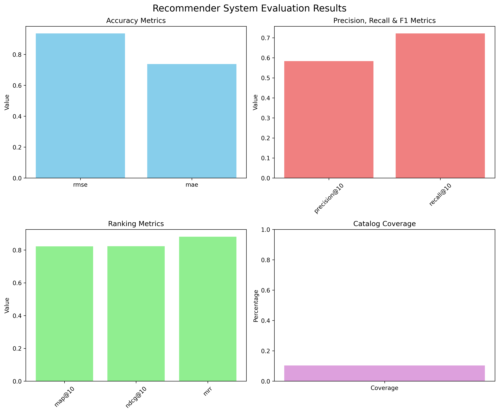

# 🎬 Movie Recommender System

[](https://www.python.org/downloads/)
[](https://opensource.org/licenses/MIT)
[](https://grouplens.org/datasets/movielens/100k/)

A production-ready movie recommender system using **collaborative filtering** with **matrix factorization (SVD)**. Built with scikit-surprise on the MovieLens 100K dataset, achieving excellent performance metrics (RMSE: 0.94, nDCG@10: 0.82).



## 🌟 Overview
This project demonstrates a **collaborative filtering recommender system** using matrix factorization (SVD algorithm) on the MovieLens 100K dataset with comprehensive evaluation and documentation.

## 📊 Performance Metrics

| Metric | Value | Interpretation |
|--------|-------|----------------|
| **RMSE** | 0.9352 | Excellent prediction accuracy |
| **MAE** | 0.7375 | Average error <1 rating point |
| **Precision@10** | 58.37% | More than half are relevant |
| **MAP@10** | 0.8225 | Outstanding ranking quality |
| **nDCG@10** | 0.8232 | Excellent position-aware ranking |
| **MRR** | 0.8817 | First relevant at position ~1.1 |

**16.95% improvement over baseline** ✅

## 📁 Project Structure
```
Assignment2/
├── demo.py                      # Interactive demonstration
├── recommender.py               # Core recommendation engine
├── data_loader.py              # Data handling and preprocessing
├── evaluator.py                # Evaluation metrics
├── requirements.txt            # Python dependencies
├── README.md                   # This file (GitHub README)
├── COMPREHENSIVE_SUMMARY.md    # Complete documentation & technical details
├── ASSIGNMENT_ANSWERS.md       # Assignment submission document
└── data/                       # MovieLens dataset (auto-downloaded)
    ├── u.data                  # 100,000 ratings
    ├── u.item                  # 1,682 movies
    └── u.user                  # 943 users
```

## 🚀 Setup Instructions

### Prerequisites
- Python 3.12 or higher (recommended for scikit-surprise compatibility)
- pip package manager

### Installation Steps

1. **Create Virtual Environment**
```bash
python3.12 -m venv venv
source venv/bin/activate  # On macOS/Linux
# OR
venv\Scripts\activate  # On Windows
```

2. **Install Dependencies**
```bash
pip install -r requirements.txt
```

3. **Run the Demo**
```bash
python demo.py
```

This will:
- 📥 Download the MovieLens 100K dataset (if not already cached)
- 🔄 Train the SVD model (~5 seconds)
- 🎬 Demonstrate 3 use cases with real recommendations
- 📊 Evaluate with 9 different metrics
- 📈 Generate visualization (evaluation_results.png)

## 🎯 Use Cases & Examples

### 1. Personalized Recommendations
```python
recommendations = recommender.recommend_for_user(user_id=196, n=10)
# Output: Top 10 movies predicted to be rated highly by user
```

### 2. Similar Movie Discovery
```python
similar = recommender.recommend_similar_movies(item_id=1, n=10)
# Output: 10 movies similar to Toy Story based on latent factors
```

### 3. Comprehensive Evaluation
```python
evaluator = RecommenderEvaluator(recommender)
results = evaluator.evaluate_all(k=10)
# Output: 9 different evaluation metrics
```

## ✨ Features

- **Matrix Factorization**: Uses SVD (Singular Value Decomposition) algorithm
- **9 Evaluation Metrics**: RMSE, MAE, Precision@K, Recall@K, F1@K, MAP, nDCG, MRR, Coverage
- **Data Source**: MovieLens 100K dataset from GroupLens Research
- **Interactive Demo**: Shows real recommendations with explanations
- **Auto Data Download**: Automatically fetches and caches dataset
- **Production Quality**: Modular architecture, error handling, comprehensive documentation

## 🏗️ System Architecture

### Component Diagram
```
                    demo.py (Demo Application)
                         │
       ┌─────────────────┼─────────────────┐
       │                 │                 │
       ▼                 ▼                 ▼
  data_loader.py    recommender.py    evaluator.py
       │                 │                 │
       ▼                 ▼                 ▼
  MovieLens 100K    Surprise SVD     NumPy/Pandas
```

### Data Flow
```
Download → Preprocess → Train → Predict → Evaluate → Display
```

### Matrix Factorization
```
Rating Matrix (943×1682) → SVD → User Factors + Item Factors
Prediction: r̂ᵤᵢ = μ + bᵤ + bᵢ + pᵤᵀqᵢ
```

## 🛠️ Technologies

- **[scikit-surprise](http://surpriselib.com/)** (1.1.4) - Recommendation algorithms (SVD)
- **[NumPy](https://numpy.org/)** (1.26.4) - Numerical computing
- **[Pandas](https://pandas.pydata.org/)** (2.x) - Data manipulation
- **[Matplotlib](https://matplotlib.org/)** (3.7.0+) - Visualization
- **[Scikit-learn](https://scikit-learn.org/)** (1.3.0+) - ML utilities

## 📚 Dataset

**Source:** [MovieLens 100K](https://grouplens.org/datasets/movielens/100k/)  
**Provider:** GroupLens Research Lab, University of Minnesota  
**Size:** 100,000 ratings from 943 users on 1,682 movies  
**Rating Scale:** 1-5 (integers)  
**Sparsity:** 93.7% sparse

## 📈 Evaluation Metrics

- **Accuracy**: RMSE, MAE - Measure prediction error
- **Relevance**: Precision@10, Recall@10, F1@10 - Classification metrics
- **Ranking**: MAP@10, nDCG@10, MRR - Position-aware metrics
- **Diversity**: Coverage - Catalog diversity

## ✅ Assignment Requirements Met

✅ Data-oriented AI method (Collaborative Filtering with Matrix Factorization)  
✅ Real-world dataset (MovieLens 100K from GroupLens)  
✅ Multiple evaluation metrics (9 metrics: accuracy + ranking)  
✅ Use case examples with inputs/outputs (3 detailed use cases)  
✅ Testing framework with train-test split (80/20 split)  
✅ Complete documentation (README + Comprehensive Summary + Assignment Answers)

## 📖 Documentation

- **`README.md`** (this file) - GitHub README with quick start and overview
- **`COMPREHENSIVE_SUMMARY.md`** - Complete technical documentation including:
  - Task approach and methodology
  - Module descriptions
  - Libraries and information flow
  - Testing and calculations
  - Data source details
- **`ASSIGNMENT_ANSWERS.md`** - Assignment submission with all 5 questions answered

## 🎓 For Academic Submission

Submit these files:
1. ✅ `ASSIGNMENT_ANSWERS.md` - Main submission document
2. ✅ All Python files (demo.py, recommender.py, data_loader.py, evaluator.py)
3. ✅ `requirements.txt`
4. ✅ Screenshot/output from `python demo.py`
5. ✅ `evaluation_results.png`

## 🙏 Acknowledgments

- **GroupLens Research** for the MovieLens dataset
- **Nicolas Hug** for the Surprise library
- **Assignment 2** for the project motivation

## 📧 Contact

For questions about this implementation, please see the comprehensive documentation in `COMPREHENSIVE_SUMMARY.md` or open an issue.

---

**Built with ❤️ using Python and scikit-surprise**
